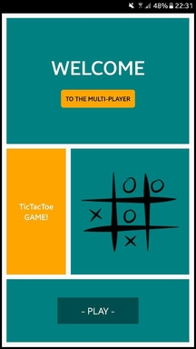
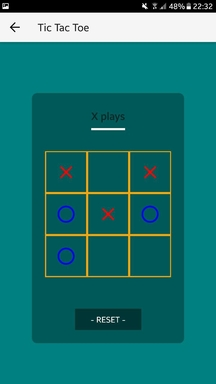
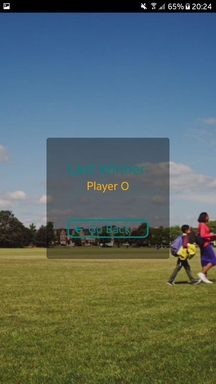

# Project Title

Tic-tac-toe React Native application

## Screenshots

First mobile screen


Second mobile screen


Third mobile screen



## Getting Started

Follow these steps to get you started after cloning the repo:

```
npm install
```

Build the app in Android Studio/Xcode

```
npm run android
```

or

```
npm run ios
```

The project should start in the emulator/device you've connected!

### Prerequisites

... will be installed with 

```
npm install
```


